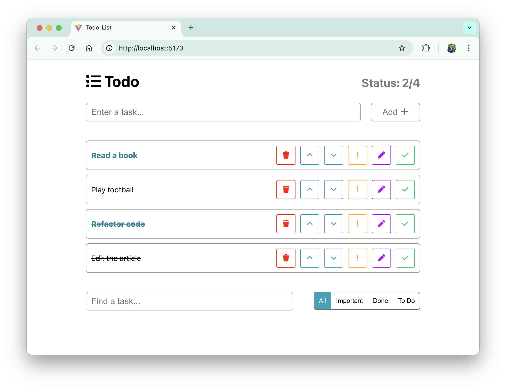

# To-Do List

This is a React To-Do List application built with a focus on dynamic task management and user-friendly interaction. The application allows users to add, edit, delete, mark important, and complete tasks while offering powerful filtering and search options. The state is persisted locally using `localStorage`, ensuring that tasks remain intact even after refreshing the page.



## 🌟 Features

- **Task Management:** Add, delete, edit, and update tasks with ease.
- **Task Priority:** Mark tasks as important or completed.
- **Filtering:** Filter tasks based on their status: All, Important, Completed, or To Do.
- **Search:** Search for tasks by title.
- **Reordering:** Move tasks up and down the list.
- **Persistent State:** Tasks are saved in `localStorage`, keeping your data intact across page reloads.

## 🛠️ Usage

- **Add a Task:** Type a task name in the input field and click "Add".
- **Mark as Important or Complete:** Use the exclamation or checkmark icons.
- **Edit a Task:** Click the edit icon to modify the task title.
- **Delete a Task:** Use the trash icon to remove a task.
- **Reorder Tasks:** Use the up/down arrows to change task order. Completed tasks are automatically moved to the bottom of the list, while important tasks are moved to the top.

## 📥 Saving and Reloading Tasks

Tasks are automatically saved in `localStorage` and will be reloaded when you revisit or refresh the page.

## 🧰 Project Structure

The application is composed of several React components that handle different parts of the todo list:

- **AddItem:** A component that handles adding new tasks.
- **EditItem:** A component used for editing existing tasks.
- **FilterButtons:** Provides buttons to filter tasks by status.
- **Header:** Displays the title and task statistics.
- **ListItems:** Renders the list of tasks.
- **SearchPanel:** Allows users to search tasks and filter by status.
- **ToDoItem:** Represents a single task and provides controls for task management.
- **ToDoListApp:** The main container component that manages the state and renders other components.

## 👨‍💻 Technologies Used

### Dependencies

1. **React:** The core library for building the user interface.
2. **FontAwesome:** Provides the icons used in the UI.
3. **classnames:** Utility for conditionally joining class names together.

### Dev Dependencies

1. **Vite:** A fast development server and build tool for modern web projects.
2. **Prettier:** A code formatter to ensure consistent code style.

## 🚀 Getting Started

### Prerequisites

Make sure you have Node.js and npm installed on your local machine.

### Installation

1. Clone the repository:

    ```bash
    git clone https://github.com/KyryloMuzychka/Todo-List.git
    cd Todo-List
    ```

2. Install the dependencies:

    ```bash
    npm install
    ```

3. Run the application:

    ```bash
    npm run dev
    ```
